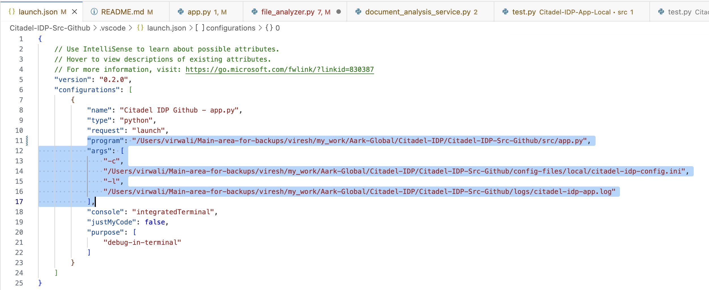
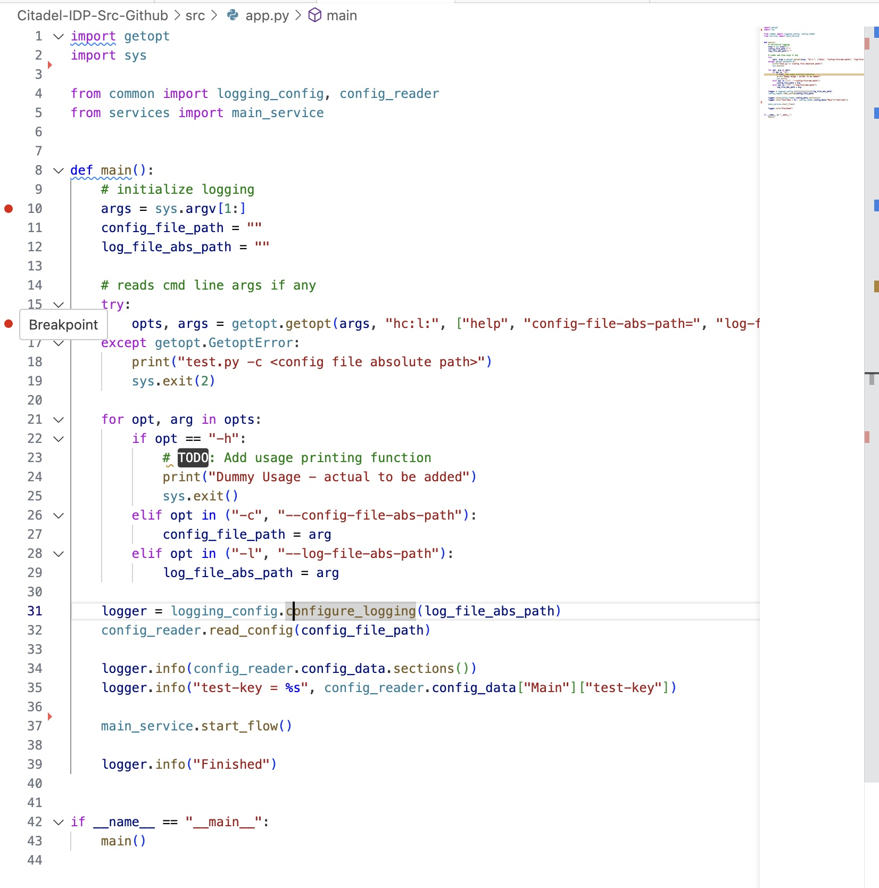
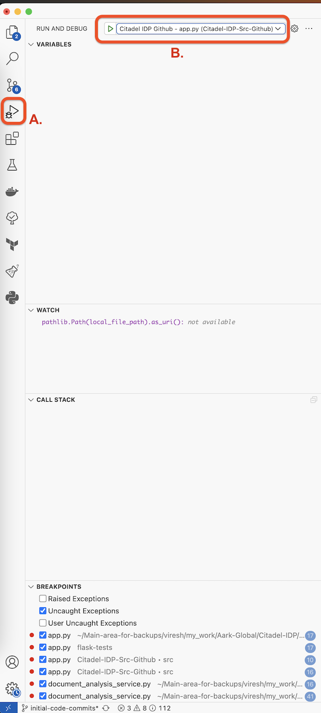
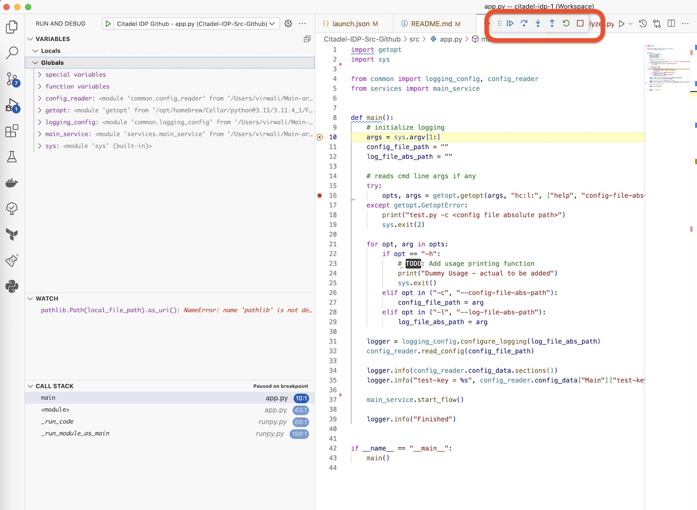

# Citadel-IDP-Src
Citadel is an advanced Intelligent Document Processing (IDP) that uses AI and enables organizations to digitize and automate unstructured data originating from various documentation sources. These include digitized document images, pdfs, word processing files, online forms, and more.

----
## Setting up the local development environment
1. Install VSCode and add the following extensions to it.
   - https://marketplace.visualstudio.com/items?itemName=ms-python.python
   - https://marketplace.visualstudio.com/items?itemName=ms-python.pylint
   - https://marketplace.visualstudio.com/items?itemName=ms-python.vscode-pylance
   - https://marketplace.visualstudio.com/items?itemName=donjayamanne.python-environment-manager
   - https://marketplace.visualstudio.com/items?itemName=KevinRose.vsc-python-indent
   - https://marketplace.visualstudio.com/items?itemName=Gruntfuggly.todo-tree
   - https://marketplace.visualstudio.com/items?itemName=njpwerner.autodocstring
   - https://marketplace.visualstudio.com/items?itemName=VisualStudioExptTeam.vscodeintellicode
   - https://marketplace.visualstudio.com/items?itemName=VisualStudioExptTeam.intellicode-api-usage-examples

2. Install Python3
   -  Install python3 from Google following the directions for your system (windows or mac)
   -  Usually for windows you download an installer and for mac you use brew.

3. Install pip
    - Again use Google and install pip on your system (windows or mac).
    - If you already have pip then upgrade it as shown below:
        ```
        python3 -m pip install --upgrade pip
        ```

4. Check python and pip version as shown below.
    ```
    virwali@WKMZT64D9B00 Citadel-IDP-Src-Github % python3 --version
    Python 3.11.4
    virwali@WKMZT64D9B00 Citadel-IDP-Src-Github % python3 -m pip --version
    pip 23.1.2 from /opt/homebrew/lib/python3.11/site-packages/pip (python 3.11)
    virwali@WKMZT64D9B00 Citadel-IDP-Src-Github %
    ```

5. Checkout the code to a folder on your laptop. For the rest of the setup procedure we wil assume that the code was checked out at e.g. `/Users/virwali/Aark-Global/Citadel-IDP/Citadel-IDP-Src-Github`
   
6. Create the python virtual env for the code.
    - Install python virtualenv package.
        ```
        python3 -m pip install virtualenv
        ```
    - Create the `.venv` virtualenv folder in code checkout.
        ```
        cd /Users/virwali/Aark-Global/Citadel-IDP/Citadel-IDP-Src-Github
        virwali@WKMZT64D9B00 Citadel-IDP-Src-Github %
        virwali@WKMZT64D9B00 Citadel-IDP-Src-Github %
        virwali@WKMZT64D9B00 Citadel-IDP-Src-Github % python3 -m virtualenv .venv
        created virtual environment CPython3.11.4.final.0-64 in 549ms
        creator CPython3Posix(dest=/Users/virwali/Aark-Global/Citadel-IDP/Citadel-IDP-Src-Github/.venv, clear=False, no_vcs_ignore=False, global=False)
        seeder FromAppData(download=False, pip=bundle, setuptools=bundle, wheel=bundle, via=copy, app_data_dir=/Users/virwali/Library/Application Support/virtualenv)
            added seed packages: pip==23.1.2, setuptools==67.8.0, wheel==0.40.0
        activators BashActivator,CShellActivator,FishActivator,NushellActivator,PowerShellActivator,PythonActivator
        virwali@WKMZT64D9B00 Citadel-IDP-Src-Github %    
        virwali@WKMZT64D9B00 Citadel-IDP-Src-Github % 
        virwali@WKMZT64D9B00 Citadel-IDP-Src-Github % ls -la
        total 32
        drwxr-xr-x  11 virwali  staff   352  8 Jul 16:31 .
        drwxr-xr-x   6 virwali  staff   192  8 Jul 14:24 ..
        -rw-r--r--@  1 virwali  staff  8196  8 Jul 12:54 .DS_Store
        drwxr-xr-x   6 virwali  staff   192  8 Jul 16:31 .venv
        drwxr-xr-x   3 virwali  staff    96 30 Jun 19:44 .vscode
        drwxr-xr-x   3 virwali  staff    96 30 Jun 13:42 __pycache__
        drwxr-xr-x   3 virwali  staff    96 30 Jun 13:53 config-files
        drwxr-xr-x   9 virwali  staff   288  4 Jul 20:09 local-blob-storage
        drwxr-xr-x   3 virwali  staff    96 30 Jun 17:02 logs
        -rw-r--r--   1 virwali  staff   419  8 Jul 14:20 requirements.txt
        drwxr-xr-x  10 virwali  staff   320  8 Jul 12:54 src
        virwali@WKMZT64D9B00 Citadel-IDP-Src-Github %
        ```
7. Activate and validate the virtualenv. <span style="color: #B72525"> <b> Note: </b> Python virtualenv works on bash shell (on mac and linux) or powershell & normal cmd console (on windows). So, either start bash shell using the bash command on the terminal or after activating the virtualenv first run bash as shown in below steps.</span>

   If you already have a .venv virtualenv created for the project code, the jump forward to point 8.
    ```
    virwali@WKMZT64D9B00 Citadel-IDP-Src-Github % source .venv/bin/activate
    (.venv) virwali@WKMZT64D9B00 Citadel-IDP-Src-Github % 
    (.venv) virwali@WKMZT64D9B00 Citadel-IDP-Src-Github % bash

    The default interactive shell is now zsh.
    To update your account to use zsh, please run `chsh -s /bin/zsh`.
    For more details, please visit https://support.apple.com/kb/HT208050.
    (.venv) %n@%m %1~ %# 
    ```
    
    - Validate that the virtualenv is activated successfully as shown below.
        ```
        (.venv) %n@%m %1~ %# which python
        /Users/virwali/Aark-Global/Citadel-IDP/Citadel-IDP-Src-Github/.venv/bin/python
        (.venv) %n@%m %1~ %#
        (.venv) %n@%m %1~ %#
        (.venv) %n@%m %1~ %# which python3
        /Users/virwali/Aark-Global/Citadel-IDP/Citadel-IDP-Src-Github/.venv/bin/python3
        (.venv) %n@%m %1~ %#
        ```
8. Apply the requirements.txt file to the virtualenv as shown below. The `requirements.txt` file is present in the root folder of the project.

    ```
    (.venv) %n@%m %1~ %# python -m pip install -r requirements.txt
    Collecting azure-ai-formrecognizer==3.2.1 (from -r requirements.txt (line 1))
    Using cached azure_ai_formrecognizer-3.2.1-py3-none-any.whl (228 kB)
    Collecting azure-common==1.1.28 (from -r requirements.txt (line 2))
    Using cached azure_common-1.1.28-py2.py3-none-any.whl (14 kB)
    Collecting azure-core==1.27.1 (from -r requirements.txt (line 3))
    Using cached azure_core-1.27.1-py3-none-any.whl (174 kB)
    Collecting black==23.3.0 (from -r requirements.txt (line 4))
    Using cached black-23.3.0-cp311-cp311-macosx_10_16_universal2.whl (2.6 MB)
    Collecting certifi==2023.5.7 (from -r requirements.txt (line 5))
    Using cached certifi-2023.5.7-py3-none-any.whl (156 kB)
    Collecting charset-normalizer==3.1.0 (from -r requirements.txt (line 6))
    Using cached charset_normalizer-3.1.0-cp311-cp311-macosx_11_0_arm64.whl (121 kB)
    Collecting click==8.1.3 (from -r requirements.txt (line 7))
    Using cached click-8.1.3-py3-none-any.whl (96 kB)
    Collecting distlib==0.3.6 (from -r requirements.txt (line 8))
    Using cached distlib-0.3.6-py2.py3-none-any.whl (468 kB)
    Collecting filelock==3.12.2 (from -r requirements.txt (line 9))
    Using cached filelock-3.12.2-py3-none-any.whl (10 kB)
    Collecting idna==3.4 (from -r requirements.txt (line 10))
    Using cached idna-3.4-py3-none-any.whl (61 kB)
    Collecting isodate==0.6.1 (from -r requirements.txt (line 11))
    Using cached isodate-0.6.1-py2.py3-none-any.whl (41 kB)
    Collecting msrest==0.7.1 (from -r requirements.txt (line 12))
    Using cached msrest-0.7.1-py3-none-any.whl (85 kB)
    Collecting mypy-extensions==1.0.0 (from -r requirements.txt (line 13))
    Using cached mypy_extensions-1.0.0-py3-none-any.whl (4.7 kB)
    Collecting oauthlib==3.2.2 (from -r requirements.txt (line 14))
    Using cached oauthlib-3.2.2-py3-none-any.whl (151 kB)
    Collecting packaging==23.1 (from -r requirements.txt (line 15))
    Using cached packaging-23.1-py3-none-any.whl (48 kB)
    Collecting pathspec==0.11.1 (from -r requirements.txt (line 16))
    Using cached pathspec-0.11.1-py3-none-any.whl (29 kB)
    Collecting platformdirs==3.8.0 (from -r requirements.txt (line 17))
    Using cached platformdirs-3.8.0-py3-none-any.whl (16 kB)
    Collecting requests==2.31.0 (from -r requirements.txt (line 18))
    Using cached requests-2.31.0-py3-none-any.whl (62 kB)
    Collecting requests-oauthlib==1.3.1 (from -r requirements.txt (line 19))
    Using cached requests_oauthlib-1.3.1-py2.py3-none-any.whl (23 kB)
    Collecting six==1.16.0 (from -r requirements.txt (line 20))
    Using cached six-1.16.0-py2.py3-none-any.whl (11 kB)
    Collecting typing_extensions==4.7.0 (from -r requirements.txt (line 21))
    Using cached typing_extensions-4.7.0-py3-none-any.whl (33 kB)
    Collecting urllib3==2.0.3 (from -r requirements.txt (line 22))
    Using cached urllib3-2.0.3-py3-none-any.whl (123 kB)
    Collecting virtualenv==20.23.1 (from -r requirements.txt (line 23))
    Using cached virtualenv-20.23.1-py3-none-any.whl (3.3 MB)
    Installing collected packages: distlib, azure-common, urllib3, typing_extensions, six, platformdirs, pathspec, packaging, oauthlib, mypy-extensions, idna, filelock, click, charset-normalizer, certifi, virtualenv, requests, isodate, black, requests-oauthlib, azure-core, msrest, azure-ai-formrecognizer
    Successfully installed azure-ai-formrecognizer-3.2.1 azure-common-1.1.28 azure-core-1.27.1 black-23.3.0 certifi-2023.5.7 charset-normalizer-3.1.0 click-8.1.3 distlib-0.3.6 filelock-3.12.2 idna-3.4 isodate-0.6.1 msrest-0.7.1 mypy-extensions-1.0.0 oauthlib-3.2.2 packaging-23.1 pathspec-0.11.1 platformdirs-3.8.0 requests-2.31.0 requests-oauthlib-1.3.1 six-1.16.0 typing_extensions-4.7.0 urllib3-2.0.3 virtualenv-20.23.1
    (.venv) %n@%m %1~ %#
    ```  
---
## Setting up azurite local storage
1.  Install azurite on your local system.
    Guide link:https://learn.microsoft.com/en-us/azure/storage/common/storage-use-azurite?tabs=npm#install-azurite

2.  Change the path present in command in batch file :
    `C:\Users\AshishChib\Documents\GitHub\Citadel-IDP-Src\scripts\activate_azurite.bat` according to your local system.

3.  To activate azurite local storage use the command as shown below:
    ```
    cd C:\Users\AshishChib\Documents\GitHub\Citadel-IDP-Src\scripts
    PS C:\Users\AshishChib\Documents\GitHub\Citadel-IDP-Src\scripts> .\activate_azurite   
    ```
---
## How to Run the app in standalone terminal
1.  To run the IDP app in terminal, first you need to prepare the local blob storage folder. 
    - In local env (`/Users/virwali/Aark-Global/Citadel-IDP/Citadel-IDP-Src-Github/config-files/local/citadel-idp-config.ini` config file property `Main.env` set to local) the IDP app uses the local folder `/Users/virwali/Aark-Global/Citadel-IDP/Citadel-IDP-Src-Github/local-blob-storage/` as the main blob file store. 
    - The folder has 2 sample companies `Company-A` and `Company-B` with an incomplete subfolder structure created in them.
    - Before you run the app, make sure that some sample files are present in the `Validation-Successful` subfolder in each company root folder.

2.   When the app starts in local env mode, it scans each company's `Validation-Successful` subfolder to make a list of input files to process. These files are moved to the company's corresponding `Inprogress` folder to indicate they have been picked for processing.
   
3. Each input document's filename is expected to be in the following format:
   `<filename part>-<document type>.<extension>` where:
   -  the filename part is the name of the file as provided by our client/upload webappe.
   -  the document type is the type/category of the file. This value is the key that is used to find the corresponding form-recognizer-model-id from [Form-Recognizer-Document-Types] section of the config file `/Users/virwali/Aark-Global/Citadel-IDP/Citadel-IDP-Src-Github/config-files/local/citadel-idp-config.ini`.
   -  If the filename doesn't follow this format an error msg is printed during processing.
   -  example file name is `1002-receipt.jpg`
4.  To run the app, use the command shown below. Adjust the value of cmd line arg `-c` and `-l` as per your local system. You should see the logs both in console and also in the log file `/Users/virwali/Aark-Global/Citadel-IDP/Citadel-IDP-Src-Github/logs/citadel-idp-app.log`
    
    ```
    (.venv) %n@%m %1~ %# cd src/
    (.venv) %n@%m %1~ %# 
    (.venv) %n@%m %1~ %# python3 -m app -c /Users/virwali/Aark-Global/Citadel-IDP/Citadel-IDP-Src-Github/config-files/local/citadel-idp-config.ini -l /Users/virwali/Aark-Global/Citadel-IDP/Citadel-IDP-Src-Github/logs/citadel-idp-app.log
    2023-07-09 09:22:56,202 [INFO] [config_reader.py:15] - Reading app config from - /Users/virwali/Main-area-for-backups/viresh/my_work/Aark-Global/Citadel-IDP/Citadel-IDP-Src-Github/config-files/local/citadel-idp-config.ini
    2023-07-09 09:22:56,203 [INFO] [app.py:34] - ['Main', 'Form-Recognizer-Document-Types']
    2023-07-09 09:22:56,203 [INFO] [app.py:35] - test-key = test-value
    2023-07-09 09:22:56,203 [INFO] [main_service.py:14] - Environment is set as 'local'
    2023-07-09 09:22:56,203 [INFO] [local_file_system_handler.py:33] - Normalized local blob storage path being used is: /Users/virwali/Main-area-for-backups/viresh/my_work/Aark-Global/Citadel-IDP/Citadel-IDP-Src-Github/local-blob-storage
    2023-07-09 09:22:56,203 [ERROR] [local_file_system_handler.py:75] - Was expecting the folder path '/VALIDATION-SUCCESSFUL' to be present but seems it doesn't exist. Skipping parent folder '/Users/virwali/Main-area-for-backups/viresh/my_work/Aark-Global/Citadel-IDP/Citadel-IDP-Src-Github/local-blob-storage/dummy-folder-with-samples' scanning.
    2023-07-09 09:22:56,206 [INFO] [local_file_system_handler.py:84] - Found 1 files in folder.
    2023-07-09 09:22:56,206 [INFO] [local_file_system_handler.py:86] - File: /Users/virwali/Main-area-for-backups/viresh/my_work/Aark-Global/Citadel-IDP/Citadel-IDP-Src-Github/local-blob-storage/Company-B/VALIDATION-SUCCESSFUL/1002-receipt.jpg
    2023-07-09 09:22:56,207 [INFO] [local_file_system_handler.py:84] - Found 1 files in folder.
    2023-07-09 09:22:56,207 [INFO] [local_file_system_handler.py:86] - File: /Users/virwali/Main-area-for-backups/viresh/my_work/Aark-Global/Citadel-IDP/Citadel-IDP-Src-Github/local-blob-storage/Company-A/VALIDATION-SUCCESSFUL/1000-receipt.jpg
    2023-07-09 09:22:56,207 [INFO] [local_file_system_handler.py:91] - Total actionable files found is 2
    2023-07-09 09:22:56,207 [INFO] [local_file_system_handler.py:43] - Starting analysis for 'InputDocument(local_file_path='/Users/virwali/Main-area-for-backups/viresh/my_work/Aark-Global/Citadel-IDP/Citadel-IDP-Src-Github/local-blob-storage/Company-B/VALIDATION-SUCCESSFUL/1002-receipt.jpg', is_local='True', document_url='file:///Users/virwali/Main-area-for-backups/viresh/my_work/Aark-Global/Citadel-IDP/Citadel-IDP-Src-Github/local-blob-storage/Company-B/VALIDATION-SUCCESSFUL/1002-receipt.jpg', document_type='receipt', document_recognizer_model_id='prebuilt-receipt', form_recognizer_endpoint='https://aarkformrecognizer.cognitiveservices.azure.com/', is_processed='False', result_json_data='None')' ....
    ```

---
## How to Run and Debug the app in VSCode
1. In VScode, open `/Users/virwali/Aark-Global/Citadel-IDP/Citadel-IDP-Src-Github/.vscode/launch.json` file

2. Edit the highlighted section of the `launch.json` file according to your local system.



   - program: should point to the full path of app.py
   - args: all cmd line arguments should go here. e.g. right now we have 2 arguments. `-c` for path to the config ini file, and `-l` for path tot he log file.

3. To run the code go to `Run` top level menu and click `Run Without Debugging`. This should open a terminal in your VSCode and run `app.py`.

4. To debug, add a breakpoint in any file. e.g. try adding 2 break points in app.py, one at line 10 and one at line 16, as shown n below image. Click on the gutter area, where you see the red dot in the image below, to set the breakpoint. Consequently click it again to remove the breakpoint.



5. To Debug the app:
    - First go to the `Run And Debug` panel on the left ribbon as sown by `A.` in the below image. 
    - Then in section `B.` choose the name as provided in the `name` field of your `launch.json` file. If you are using the same name without changes, then it should show `Citadel IDP Github - app.py`. 
    - Once the correct launch profile name is selected, click the play button.



6. Once the debug session has started, you should see the executions top at `line 10 in app.py`, where you added the first breakpoint. You can see the variables and their values at the top, and call trace at the bottom. A small ribbon (highlighted in the red rectangle in the below image) should show at the top. You can sue this to `continue`, `step over` and `step into` the code statement at the breakpoint where the execution has stopped.



---

## Before you commit and push your code....

1. Make sure you generate the latest `requirements.txt` file to add to your commit. This is only needed if you added any new packages to your local code using pip. To generate the new `requirements.txt` run the following cmd from the root of your project folder i.e. from `/Users/virwali/Aark-Global/Citadel-IDP/Citadel-IDP-Src-Github`

    ```
    (.venv) %n@%m %1~ %# pwd
    /Users/virwali/Main-area-for-backups/viresh/my_work/Aark-Global/Citadel-IDP/Citadel-IDP-Src-Github
    (.venv) %n@%m %1~ %# 
    (.venv) %n@%m %1~ %# 
    (.venv) %n@%m %1~ %# python -m pip freeze > requirements.txt 
    (.venv) %n@%m %1~ %# 
    (.venv) %n@%m %1~ %# cat requirements.txt 
    azure-ai-formrecognizer==3.2.1
    azure-common==1.1.28
    azure-core==1.27.1
    black==23.3.0
    certifi==2023.5.7
    charset-normalizer==3.1.0
    click==8.1.3
    distlib==0.3.6
    filelock==3.12.2
    idna==3.4
    isodate==0.6.1
    msrest==0.7.1
    mypy-extensions==1.0.0
    oauthlib==3.2.2
    packaging==23.1
    pathspec==0.11.1
    platformdirs==3.8.0
    requests==2.31.0
    requests-oauthlib==1.3.1
    six==1.16.0
    typing_extensions==4.7.0
    urllib3==2.0.3
    virtualenv==20.23.1
    (.venv) %n@%m %1~ %#
    ```
2. Be sure to add any folders or files that you dont want to push to github, to be ignored by git change tracker by adding them to `.gitignore` file in the root folder of the project. e.g. your local .venv folder should not be comitted to git and pushed to github. So this fodler is already added to `.gitignore`. 
